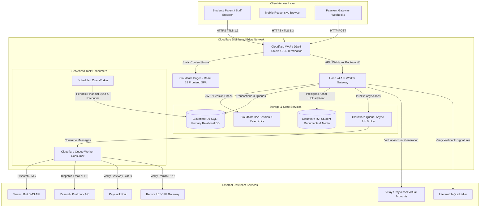
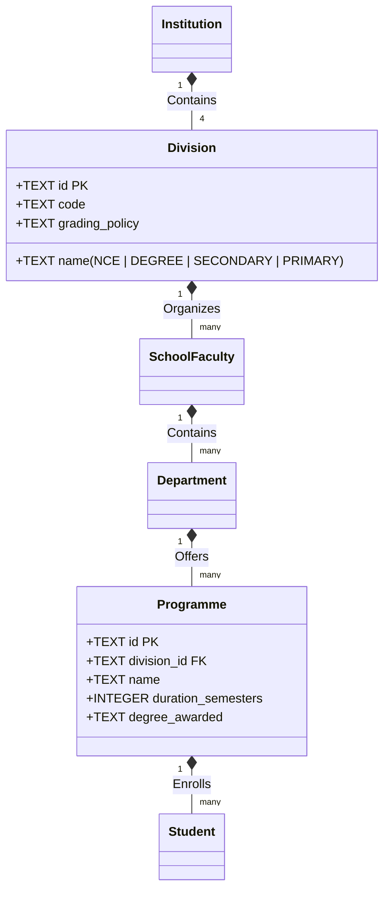

# ENTERPRISE DIGITAL CAMPUS PORTAL (COEKA PORTAL)
## TECHNICAL SPECIFICATION DOCUMENT & END-TO-END IMPLEMENTATION BLUEPRINT

**Client:** College of Education, Katsina-Ala (`coekatsinaala.edu.ng`), Benue State, Nigeria  
**Vendor:** Fruitfulujah Project (`fruitfulujah.com`), Katsina-Ala, Benue State, Nigeria  
**Founder & Technical Lead:** Sefa Livingstone Tsegha  
**Document Version:** 1.0.0 (Production Blueprint)  
**Date:** September 2026  
**Target Audience:** Core Engineering Team, DevOps Engineers, Database Administrators, Security Auditors, and COEKA Directorate of ICT  

---

## 1. Executive & Contextual Foundation

### 1.1 Project Mission & Scope
The College of Education, Katsina-Ala (COEKA) is a multi-divisional tertiary and basic educational institution in Benue State, Nigeria. Beyond its primary mandate under the National Commission for Colleges of Education (NCCE) to award the **Nigeria Certificate in Education (NCE)**, the College operates:
1. **Degree Programmes** in affiliation with accredited Nigerian Universities under National Universities Commission (NUC) standards.
2. **Demonstration Secondary School** offering Junior and Senior Secondary education (BECE, WAEC, NECO).
3. **Staff Primary School** providing nursery and basic elementary primary education.
4. **Administrative & Auxiliary Units:** Registry, Bursary, Academic Planning, Student Affairs, Works/Hostels, Directorate of ICT, and the Academic Board / Senate.

Prior to this initiative, admissions, registrations, fee collections, academic records, and hostel allocations were administered across disparate, semi-automated, or manual spreadsheets. This operational fragmentation introduced serious operational risks: fee leakage, duplicate student matriculation identities, protracted result compilation cycles, and delayed clearance for graduation.

**The Objective:** Fruitfulujah Project has been contracted to architect, develop, deploy, and maintain a unified, cloud-native **Enterprise Digital Campus Portal**. This Technical Specification Document (TSD) establishes the architectural blueprint, data models, integration protocols, security policies, and 18-week sprint-by-sprint engineering plan to execute this platform from initial repository setup to production go-live.

### 1.2 Architectural Foundation: The Fruitfulujah & AfaTor Pedigree
Rather than constructing institutional infrastructure from an untested baseline, the COEKA Portal directly incorporates proven architectures from two established Fruitfulujah systems:
* **Fruitfulujah Fintech Engine:** Incorporating an immutable double-entry financial ledger, Kobo-integer arithmetic, cryptographic HMAC-SHA256 signature verification, idempotent payment webhooks, and automated multi-gateway failover between Nigerian payment rails (Paystack, Interswitch, Remita/BSCPP, and VPay/Payvessel).
* **AfaTor EdTech Engine:** Leveraging tested school record workflows, continuous assessment (CA) capture, psychomotor and affective domain evaluation, Nigerian grading scales, automated broadsheet tabulation, and cryptographically verifiable terminal report card generation.

---

## 2. High-Level System Architecture & Infrastructure

### 2.1 The Edge-First Serverless Philosophy
Traditional Nigerian university portals rely on on-premise servers or monolithic virtual private servers (VPS) hosted in overseas data centers. In Katsina-Ala, local infrastructure faces frequent municipal grid instability, high diesel operational expenditure, and local backhaul bandwidth congestion. Monolithic remote servers conversely suffer from high network latency and catastrophic collapse during seasonal traffic spikes (e.g., post-UTME screening releases or semester fee deadlines).

The COEKA Portal is architected strictly as a **Cloudflare-Native Edge-First Application**:
* **Zero Physical Infrastructure:** No on-campus server hardware to purchase, fuel, air-condition, or maintain.
* **Hyper-Distributed Edge Compute:** Server-side logic executes inside **Cloudflare Workers** across 330+ edge locations globally (including Nigerian points of presence in Lagos and Abuja), providing sub-30ms response times across Nigeria.
* **Static Asset Global Delivery:** The frontend Single Page Application (SPA) is delivered via **Cloudflare Pages** backed by edge caching.
* **Transactional State at the Edge:** Tabular data resides in **Cloudflare D1** (distributed SQLite at the edge), providing immediate SQL transactional consistency with zero server patching overhead.
* **Asynchronous Resiliency:** Intensive batch operations (bulk result computation, SMS/email dispatch, payment sweeps) are offloaded to **Cloudflare Queues** to prevent HTTP request timeouts.
* **Secure Document Lake:** Unstructured documents (student passport photos, scanned credentials, digital transcripts, fee receipts) are stored in **Cloudflare R2** (S3-compatible, zero egress fees).

### 2.2 End-to-End System Topology



### 2.3 Monorepo Structure & Engineering Workspace
The codebase is structured as a TypeScript monorepo governed by Turborepo or npm workspaces:

```
coeka-portal/
├── apps/
│   ├── web/                          # React 19 SPA (Cloudflare Pages)
│   │   ├── public/
│   │   │   ├── assets/
│   │   │   └── manifest.json
│   │   ├── src/
│   │   │   ├── components/           # Atomic UI (Bento Grid, Forms, Modals, Tables)
│   │   │   ├── features/
│   │   │   │   ├── website/          # Public CMS, News, Events, Portal Home
│   │   │   │   ├── admissions/       # Multi-track application & screening forms
│   │   │   │   ├── sims/             # Student biodata, courses, digital ID
│   │   │   │   ├── finance/          # Student invoices, payments, receipts
│   │   │   │   ├── results/          # Score entry, broadsheet, approvals
│   │   │   │   ├── hostels/          # Real-time room grid & reservation
│   │   │   │   ├── staff/            # HR directory, leave, assignments
│   │   │   │   └── parent/           # Ward tracking & report cards
│   │   │   ├── hooks/                # useAuth, useLedger, useRealtime, usePermissions
│   │   │   ├── lib/                  # Formatter utils (KoboToNaira, date formatting)
│   │   │   ├── routes/               # Hash / History Client Router
│   │   │   ├── App.tsx
│   │   │   └── main.tsx
│   │   ├── package.json
│   │   ├── tailwind.config.ts
│   │   └── vite.config.ts
│   └── worker-api/                   # Hono v4 REST API (Cloudflare Worker)
│       ├── src/
│       │   ├── middleware/           # auth.ts, rbac.ts, koboGuard.ts, rateLimit.ts
│       │   ├── routes/
│       │   │   ├── auth.ts           # Login, OTP, Password Reset, 2FA
│       │   │   ├── website.ts        # Dynamic news, admissions notice API
│       │   │   ├── admissions.ts     # Multi-track application endpoints
│       │   │   ├── students.ts       # Biodata, course registration, clearances
│       │   │   ├── finance.ts        # Payment intents, virtual accounts, receipts
│       │   │   ├── webhooks.ts       # Paystack, Remita, Interswitch, VPay listeners
│       │   │   ├── results.ts        # CA/Exam score ingestion, broadsheets
│       │   │   ├── hostels.ts        # Space lock, verification, allocation
│       │   │   ├── staff.ts          # Faculty allocations, leave approvals
│       │   │   └── parent.ts         # Multi-ward telemetry
│       │   ├── queues/               # Consumer handlers (notifications, reconciliation)
│       │   ├── services/             # LedgerEngine, ResultComputer, GatewayFailover
│       │   ├── index.ts              # Worker entrypoint & fetch listener
│       │   └── types.ts              # Cloudflare Env bindings
│       ├── wrangler.toml             # Bindings specification
│       └── package.json
├── packages/
│   ├── database/                     # D1 Database Migrations & Drizzle Schemas
│   │   ├── migrations/
│   │   ├── src/
│   │   │   ├── schema/
│   │   │   └── index.ts
│   │   └── drizzle.config.ts
│   └── shared-types/                 # Shared TypeScript interfaces & DTOs
│       └── src/index.ts
├── package.json
├── turbo.json
└── README.md
```

### 2.4 Cloudflare Environment Binding Specification (`wrangler.toml`)
The unified configuration binding all Cloudflare serverless components:

```toml
name = "coeka-portal-api"
main = "src/index.ts"
compatibility_date = "2026-09-01"
compatibility_flags = ["nodejs_compat"]

# Serve the compiled React SPA static assets from apps/web/dist
assets = { directory = "../web/dist", binding = "ASSETS" }

# Production Custom Domain Routes
routes = [
  { pattern = "portal.coekatsinaala.edu.ng/*", zone_name = "coekatsinaala.edu.ng" },
  { pattern = "api.coekatsinaala.edu.ng/*", zone_name = "coekatsinaala.edu.ng" },
  { pattern = "coekatsinaala.edu.ng/*", zone_name = "coekatsinaala.edu.ng" }
]

# 1. Primary Cloudflare D1 SQL Database
[[d1_databases]]
binding = "DB"
database_name = "coeka-production-db"
database_id = "coeka-d1-prod-001"

# 2. Cloudflare KV Store for Session Management & Sliding-Window Rate Limiting
[[kv_namespaces]]
binding = "SESSION_KV"
id = "coeka-kv-sessions-prod"

[[kv_namespaces]]
binding = "RATE_LIMIT_KV"
id = "coeka-kv-ratelimit-prod"

# 3. Cloudflare R2 Object Storage for Document Lake
[[r2_buckets]]
binding = "DOCUMENTS_BUCKET"
bucket_name = "coeka-document-lake"

# 4. Cloudflare Queues for Background Asynchronous Processing
[[queues.producers]]
queue = "coeka-async-queue"
binding = "ASYNC_QUEUE"

[[queues.consumers]]
queue = "coeka-async-queue"
max_batch_size = 20
max_batch_timeout = 10
max_retries = 5

# 5. Scheduled Cron Triggers for Automated Reconciliation & Nightly Sweeps
[triggers]
crons = ["*/15 * * * *", "0 1 * * *"]
```

---

## 3. Institutional Multi-Track Domain & Entity Data Model

### 3.1 Multi-Divisional Institutional Hierarchy
COEKA's operational structure requires a flexible schema supporting four distinct academic divisions within a single unified database:



### 3.2 Complete Production DDL Schema (Cloudflare D1 SQL)

```sql
-- ============================================================================
-- 1. INSTITUTIONAL STRUCTURE & ORGANIZATIONAL HIERARCHY
-- ============================================================================

CREATE TABLE divisions (
    id TEXT PRIMARY KEY,
    name TEXT NOT NULL UNIQUE CHECK(name IN ('NCE', 'DEGREE', 'SECONDARY', 'PRIMARY')),
    code TEXT NOT NULL UNIQUE,
    grading_policy TEXT NOT NULL CHECK(grading_policy IN ('NCCE_5_POINT', 'NUC_DEGREE_5_POINT', 'SECONDARY_WAEC', 'PRIMARY_BASIC')),
    created_at INTEGER NOT NULL DEFAULT (strftime('%s', 'now'))
);

CREATE TABLE schools_faculties (
    id TEXT PRIMARY KEY,
    division_id TEXT NOT NULL,
    name TEXT NOT NULL,
    code TEXT NOT NULL UNIQUE,
    dean_staff_id TEXT,
    created_at INTEGER NOT NULL DEFAULT (strftime('%s', 'now')),
    FOREIGN KEY (division_id) REFERENCES divisions(id) ON DELETE CASCADE
);

CREATE TABLE departments (
    id TEXT PRIMARY KEY,
    school_id TEXT NOT NULL,
    name TEXT NOT NULL,
    code TEXT NOT NULL UNIQUE,
    hod_staff_id TEXT,
    created_at INTEGER NOT NULL DEFAULT (strftime('%s', 'now')),
    FOREIGN KEY (school_id) REFERENCES schools_faculties(id) ON DELETE CASCADE
);

CREATE TABLE programmes (
    id TEXT PRIMARY KEY,
    department_id TEXT NOT NULL,
    name TEXT NOT NULL,
    code TEXT NOT NULL UNIQUE,
    duration_years INTEGER NOT NULL DEFAULT 3,
    total_semesters INTEGER NOT NULL DEFAULT 6,
    qualification_awarded TEXT NOT NULL, -- e.g., 'NCE in Biology/Integrated Science'
    is_active INTEGER NOT NULL DEFAULT 1,
    FOREIGN KEY (department_id) REFERENCES departments(id) ON DELETE CASCADE
);

CREATE TABLE academic_sessions (
    id TEXT PRIMARY KEY,
    name TEXT NOT NULL UNIQUE, -- e.g., '2026/2027'
    start_date TEXT NOT NULL,
    end_date TEXT NOT NULL,
    is_current INTEGER NOT NULL DEFAULT 0,
    created_at INTEGER NOT NULL DEFAULT (strftime('%s', 'now'))
);

CREATE TABLE semesters_terms (
    id TEXT PRIMARY KEY,
    session_id TEXT NOT NULL,
    division_id TEXT NOT NULL,
    name TEXT NOT NULL, -- 'First Semester', 'Second Semester', 'First Term', etc.
    term_number INTEGER NOT NULL CHECK(term_number IN (1, 2, 3)),
    is_current INTEGER NOT NULL DEFAULT 0,
    registration_open INTEGER NOT NULL DEFAULT 0,
    result_upload_open INTEGER NOT NULL DEFAULT 0,
    FOREIGN KEY (session_id) REFERENCES academic_sessions(id) ON DELETE CASCADE,
    FOREIGN KEY (division_id) REFERENCES divisions(id) ON DELETE CASCADE
);

-- ============================================================================
-- 2. IDENTITY, ROLES & ACCESS CONTROL (RBAC)
-- ============================================================================

CREATE TABLE users (
    id TEXT PRIMARY KEY,
    username TEXT NOT NULL UNIQUE, -- Phone Number, Matric Number, or Staff ID
    email TEXT UNIQUE,
    phone_number TEXT NOT NULL UNIQUE,
    password_hash TEXT NOT NULL,
    user_type TEXT NOT NULL CHECK(user_type IN ('APPLICANT', 'STUDENT', 'STAFF', 'PARENT', 'ADMIN')),
    is_active INTEGER NOT NULL DEFAULT 1,
    two_factor_secret TEXT,
    two_factor_enabled INTEGER NOT NULL DEFAULT 0,
    created_at INTEGER NOT NULL DEFAULT (strftime('%s', 'now')),
    updated_at INTEGER NOT NULL DEFAULT (strftime('%s', 'now'))
);

CREATE TABLE roles (
    id TEXT PRIMARY KEY,
    name TEXT NOT NULL UNIQUE, -- 'SUPER_ADMIN', 'BURSAR', 'REGISTRAR', 'DEAN', 'HOD', 'EXAM_OFFICER', 'LECTURER', 'STUDENT', 'PARENT'
    description TEXT
);

CREATE TABLE permissions (
    id TEXT PRIMARY KEY,
    code TEXT NOT NULL UNIQUE, -- 'results:upload', 'results:approve_dean', 'finance:create_fee', 'students:clear'
    module TEXT NOT NULL
);

CREATE TABLE role_permissions (
    role_id TEXT NOT NULL,
    permission_id TEXT NOT NULL,
    PRIMARY KEY (role_id, permission_id),
    FOREIGN KEY (role_id) REFERENCES roles(id) ON DELETE CASCADE,
    FOREIGN KEY (permission_id) REFERENCES permissions(id) ON DELETE CASCADE
);

CREATE TABLE user_roles (
    user_id TEXT NOT NULL,
    role_id TEXT NOT NULL,
    PRIMARY KEY (user_id, role_id),
    FOREIGN KEY (user_id) REFERENCES users(id) ON DELETE CASCADE,
    FOREIGN KEY (role_id) REFERENCES roles(id) ON DELETE CASCADE
);

-- ============================================================================
-- 3. ADMISSIONS & APPLICANT PIPELINE
-- ============================================================================

CREATE TABLE admissions_cycles (
    id TEXT PRIMARY KEY,
    session_id TEXT NOT NULL,
    division_id TEXT NOT NULL,
    name TEXT NOT NULL,
    application_fee_kobo INTEGER NOT NULL CHECK(application_fee_kobo >= 0),
    start_date TEXT NOT NULL,
    end_date TEXT NOT NULL,
    is_open INTEGER NOT NULL DEFAULT 1,
    FOREIGN KEY (session_id) REFERENCES academic_sessions(id) ON DELETE CASCADE,
    FOREIGN KEY (division_id) REFERENCES divisions(id) ON DELETE CASCADE
);

CREATE TABLE applications (
    id TEXT PRIMARY KEY,
    cycle_id TEXT NOT NULL,
    user_id TEXT NOT NULL,
    programme_id TEXT NOT NULL,
    application_number TEXT NOT NULL UNIQUE,
    jamb_registration_number TEXT,
    first_name TEXT NOT NULL,
    middle_name TEXT,
    last_name TEXT NOT NULL,
    gender TEXT NOT NULL CHECK(gender IN ('MALE', 'FEMALE')),
    date_of_birth TEXT NOT NULL,
    state_of_origin TEXT NOT NULL,
    lga_of_origin TEXT NOT NULL,
    passport_photo_url TEXT,
    o_level_data_json TEXT, -- JSON blob for subjects and grades
    status TEXT NOT NULL DEFAULT 'SUBMITTED' CHECK(status IN ('DRAFT', 'SUBMITTED', 'SCREENED', 'ADMITTED', 'ACCEPTED', 'REJECTED')),
    admission_letter_url TEXT,
    acceptance_fee_paid INTEGER NOT NULL DEFAULT 0,
    created_at INTEGER NOT NULL DEFAULT (strftime('%s', 'now')),
    FOREIGN KEY (cycle_id) REFERENCES admissions_cycles(id) ON DELETE CASCADE,
    FOREIGN KEY (user_id) REFERENCES users(id) ON DELETE CASCADE,
    FOREIGN KEY (programme_id) REFERENCES programmes(id) ON DELETE CASCADE
);

-- ============================================================================
-- 4. STUDENT INFORMATION MANAGEMENT SYSTEM (SIMS)
-- ============================================================================

CREATE TABLE students (
    id TEXT PRIMARY KEY,
    user_id TEXT NOT NULL UNIQUE,
    division_id TEXT NOT NULL,
    programme_id TEXT NOT NULL,
    current_level INTEGER NOT NULL, -- 100, 200, 300, 400 (or JSS1-3, SSS1-3, Basic1-6)
    matric_number TEXT NOT NULL UNIQUE,
    admission_year INTEGER NOT NULL,
    first_name TEXT NOT NULL,
    middle_name TEXT,
    last_name TEXT NOT NULL,
    gender TEXT NOT NULL CHECK(gender IN ('MALE', 'FEMALE')),
    date_of_birth TEXT NOT NULL,
    state_of_origin TEXT NOT NULL,
    lga_of_origin TEXT NOT NULL,
    blood_group TEXT,
    contact_address TEXT NOT NULL,
    passport_photo_url TEXT NOT NULL,
    qr_code_signature TEXT NOT NULL, -- Cryptographic verification string for physical ID cards
    academic_status TEXT NOT NULL DEFAULT 'ACTIVE' CHECK(academic_status IN ('ACTIVE', 'PROBATION', 'WITHDRAWN', 'SUSPENDED', 'GRADUATED')),
    created_at INTEGER NOT NULL DEFAULT (strftime('%s', 'now')),
    FOREIGN KEY (user_id) REFERENCES users(id) ON DELETE CASCADE,
    FOREIGN KEY (division_id) REFERENCES divisions(id) ON DELETE RESTRICT,
    FOREIGN KEY (programme_id) REFERENCES programmes(id) ON DELETE RESTRICT
);

CREATE TABLE courses (
    id TEXT PRIMARY KEY,
    programme_id TEXT NOT NULL,
    code TEXT NOT NULL, -- e.g., 'EDU 111', 'CSC 212'
    title TEXT NOT NULL,
    credit_units INTEGER NOT NULL CHECK(credit_units > 0),
    level INTEGER NOT NULL,
    semester_term INTEGER NOT NULL CHECK(semester_term IN (1, 2, 3)),
    is_compulsory INTEGER NOT NULL DEFAULT 1,
    prerequisite_course_id TEXT,
    created_at INTEGER NOT NULL DEFAULT (strftime('%s', 'now')),
    FOREIGN KEY (programme_id) REFERENCES programmes(id) ON DELETE CASCADE,
    FOREIGN KEY (prerequisite_course_id) REFERENCES courses(id) ON DELETE SET NULL,
    UNIQUE(programme_id, code)
);

CREATE TABLE course_registrations (
    id TEXT PRIMARY KEY,
    student_id TEXT NOT NULL,
    semester_id TEXT NOT NULL,
    course_id TEXT NOT NULL,
    registered_at INTEGER NOT NULL DEFAULT (strftime('%s', 'now')),
    is_approved_by_adviser INTEGER NOT NULL DEFAULT 0,
    adviser_staff_id TEXT,
    FOREIGN KEY (student_id) REFERENCES students(id) ON DELETE CASCADE,
    FOREIGN KEY (semester_id) REFERENCES semesters_terms(id) ON DELETE CASCADE,
    FOREIGN KEY (course_id) REFERENCES courses(id) ON DELETE CASCADE,
    UNIQUE(student_id, semester_id, course_id)
);

-- ============================================================================
-- 5. ACADEMIC RECORDS & RESULT PROCESSING
-- ============================================================================

CREATE TABLE student_grades (
    id TEXT PRIMARY KEY,
    registration_id TEXT NOT NULL UNIQUE,
    ca_score REAL CHECK(ca_score >= 0 AND ca_score <= 40),
    exam_score REAL CHECK(exam_score >= 0 AND exam_score <= 70),
    total_score REAL GENERATED ALWAYS AS (COALESCE(ca_score, 0) + COALESCE(exam_score, 0)) STORED,
    letter_grade TEXT CHECK(letter_grade IN ('A', 'B', 'C', 'D', 'E', 'F')),
    grade_point REAL,
    is_resit INTEGER NOT NULL DEFAULT 0,
    created_at INTEGER NOT NULL DEFAULT (strftime('%s', 'now')),
    updated_at INTEGER NOT NULL DEFAULT (strftime('%s', 'now')),
    FOREIGN KEY (registration_id) REFERENCES course_registrations(id) ON DELETE CASCADE
);

CREATE TABLE result_approval_audits (
    id TEXT PRIMARY KEY,
    semester_id TEXT NOT NULL,
    department_id TEXT NOT NULL,
    level INTEGER NOT NULL,
    stage TEXT NOT NULL CHECK(stage IN ('LECTURER_SUBMITTED', 'HOD_RECOMMENDED', 'DEAN_VERIFIED', 'SENATE_APPROVED')),
    actor_staff_id TEXT NOT NULL,
    action_timestamp INTEGER NOT NULL DEFAULT (strftime('%s', 'now')),
    digital_signature TEXT NOT NULL, -- HMAC signature of all grade hashes in the batch
    comments TEXT,
    FOREIGN KEY (semester_id) REFERENCES semesters_terms(id) ON DELETE RESTRICT,
    FOREIGN KEY (department_id) REFERENCES departments(id) ON DELETE RESTRICT
);

-- ============================================================================
-- 6. THE FINANCIAL ENGINE & IMMUTABLE LEDGER
-- ============================================================================

CREATE TABLE fee_categories (
    id TEXT PRIMARY KEY,
    division_id TEXT NOT NULL,
    name TEXT NOT NULL, -- 'Tuition', 'Acceptance', 'Hostel', 'Teaching Practice', 'Convocation'
    code TEXT NOT NULL UNIQUE,
    is_recurring INTEGER NOT NULL DEFAULT 1,
    FOREIGN KEY (division_id) REFERENCES divisions(id) ON DELETE RESTRICT
);

CREATE TABLE fee_schedules (
    id TEXT PRIMARY KEY,
    category_id TEXT NOT NULL,
    session_id TEXT NOT NULL,
    level INTEGER NOT NULL,
    amount_kobo INTEGER NOT NULL CHECK(amount_kobo > 0),
    due_date TEXT,
    created_at INTEGER NOT NULL DEFAULT (strftime('%s', 'now')),
    FOREIGN KEY (category_id) REFERENCES fee_categories(id) ON DELETE CASCADE,
    FOREIGN KEY (session_id) REFERENCES academic_sessions(id) ON DELETE CASCADE
);

CREATE TABLE student_invoices (
    id TEXT PRIMARY KEY,
    student_id TEXT NOT NULL,
    fee_schedule_id TEXT NOT NULL,
    invoice_number TEXT NOT NULL UNIQUE,
    amount_due_kobo INTEGER NOT NULL CHECK(amount_due_kobo > 0),
    amount_paid_kobo INTEGER NOT NULL DEFAULT 0 CHECK(amount_paid_kobo >= 0),
    status TEXT NOT NULL DEFAULT 'UNPAID' CHECK(status IN ('UNPAID', 'PARTIALLY_PAID', 'PAID', 'CANCELLED')),
    created_at INTEGER NOT NULL DEFAULT (strftime('%s', 'now')),
    FOREIGN KEY (student_id) REFERENCES students(id) ON DELETE RESTRICT,
    FOREIGN KEY (fee_schedule_id) REFERENCES fee_schedules(id) ON DELETE RESTRICT
);

CREATE TABLE student_virtual_accounts (
    id TEXT PRIMARY KEY,
    student_id TEXT NOT NULL UNIQUE,
    bank_name TEXT NOT NULL, -- e.g., 'Wema Bank / VPay', 'Moniepoint'
    account_number TEXT NOT NULL UNIQUE,
    account_name TEXT NOT NULL,
    provider TEXT NOT NULL CHECK(provider IN ('VPAY', 'PAYVESSEL')),
    created_at INTEGER NOT NULL DEFAULT (strftime('%s', 'now')),
    FOREIGN KEY (student_id) REFERENCES students(id) ON DELETE CASCADE
);

CREATE TABLE transactions (
    id TEXT PRIMARY KEY,
    invoice_id TEXT NOT NULL,
    reference TEXT NOT NULL UNIQUE,
    gateway TEXT NOT NULL CHECK(gateway IN ('REMITA_BSCPP', 'VPAY', 'PAYVESSEL', 'PAYSTACK', 'INTERSWITCH')),
    gateway_reference TEXT,
    type TEXT NOT NULL CHECK(type IN ('CREDIT', 'DEBIT')),
    amount_kobo INTEGER NOT NULL CHECK(amount_kobo > 0),
    service_charge_kobo INTEGER NOT NULL DEFAULT 0,
    settlement_status TEXT NOT NULL DEFAULT 'PENDING' CHECK(settlement_status IN ('PENDING', 'SUCCESS', 'FAILED')),
    cryptographic_signature TEXT NOT NULL,
    created_at INTEGER NOT NULL DEFAULT (strftime('%s', 'now')),
    reconciled_at INTEGER,
    FOREIGN KEY (invoice_id) REFERENCES student_invoices(id) ON DELETE RESTRICT
);

-- ============================================================================
-- 7. HOSTEL MANAGEMENT SYSTEM
-- ============================================================================

CREATE TABLE hostels (
    id TEXT PRIMARY KEY,
    name TEXT NOT NULL UNIQUE,
    gender TEXT NOT NULL CHECK(gender IN ('MALE', 'FEMALE')),
    total_capacity INTEGER NOT NULL CHECK(total_capacity > 0),
    is_active INTEGER NOT NULL DEFAULT 1
);

CREATE TABLE hostel_rooms (
    id TEXT PRIMARY KEY,
    hostel_id TEXT NOT NULL,
    room_number TEXT NOT NULL,
    capacity INTEGER NOT NULL CHECK(capacity > 0),
    floor_number INTEGER NOT NULL DEFAULT 0,
    FOREIGN KEY (hostel_id) REFERENCES hostels(id) ON DELETE CASCADE,
    UNIQUE(hostel_id, room_number)
);

CREATE TABLE hostel_bedspaces (
    id TEXT PRIMARY KEY,
    room_id TEXT NOT NULL,
    bed_label TEXT NOT NULL, -- 'Bed 1', 'Bed 2'
    is_occupied INTEGER NOT NULL DEFAULT 0,
    reserved_until INTEGER, -- Unix epoch for holding lock during checkout
    FOREIGN KEY (room_id) REFERENCES hostel_rooms(id) ON DELETE CASCADE,
    UNIQUE(room_id, bed_label)
);

CREATE TABLE hostel_allocations (
    id TEXT PRIMARY KEY,
    bedspace_id TEXT NOT NULL,
    student_id TEXT NOT NULL,
    session_id TEXT NOT NULL,
    transaction_id TEXT NOT NULL UNIQUE,
    allocated_at INTEGER NOT NULL DEFAULT (strftime('%s', 'now')),
    status TEXT NOT NULL DEFAULT 'ACTIVE' CHECK(status IN ('ACTIVE', 'CHECKED_OUT', 'REVOKED')),
    FOREIGN KEY (bedspace_id) REFERENCES hostel_bedspaces(id) ON DELETE RESTRICT,
    FOREIGN KEY (student_id) REFERENCES students(id) ON DELETE RESTRICT,
    FOREIGN KEY (session_id) REFERENCES academic_sessions(id) ON DELETE RESTRICT,
    FOREIGN KEY (transaction_id) REFERENCES transactions(id) ON DELETE RESTRICT
);

-- ============================================================================
-- 8. STAFF MANAGEMENT & HR PORTAL
-- ============================================================================

CREATE TABLE staff_profiles (
    id TEXT PRIMARY KEY,
    user_id TEXT NOT NULL UNIQUE,
    staff_id_number TEXT NOT NULL UNIQUE, -- e.g., 'COEKA/ACA/2018/142'
    department_id TEXT NOT NULL,
    first_name TEXT NOT NULL,
    last_name TEXT NOT NULL,
    cadre TEXT NOT NULL CHECK(cadre IN ('ACADEMIC', 'NON_ACADEMIC')),
    designation TEXT NOT NULL, -- 'Chief Lecturer', 'Senior Lecturer', 'Administrative Officer'
    employment_date TEXT NOT NULL,
    highest_qualification TEXT NOT NULL,
    FOREIGN KEY (user_id) REFERENCES users(id) ON DELETE CASCADE,
    FOREIGN KEY (department_id) REFERENCES departments(id) ON DELETE RESTRICT
);

CREATE TABLE staff_course_allocations (
    id TEXT PRIMARY KEY,
    staff_id TEXT NOT NULL,
    course_id TEXT NOT NULL,
    semester_id TEXT NOT NULL,
    role TEXT NOT NULL DEFAULT 'PRIMARY_LECTURER' CHECK(role IN ('PRIMARY_LECTURER', 'CO_LECTURER')),
    FOREIGN KEY (staff_id) REFERENCES staff_profiles(id) ON DELETE CASCADE,
    FOREIGN KEY (course_id) REFERENCES courses(id) ON DELETE CASCADE,
    FOREIGN KEY (semester_id) REFERENCES semesters_terms(id) ON DELETE CASCADE,
    UNIQUE(staff_id, course_id, semester_id)
);

-- ============================================================================
-- 9. PARENT PORTAL & WARD MONITORING
-- ============================================================================

CREATE TABLE parents (
    id TEXT PRIMARY KEY,
    user_id TEXT NOT NULL UNIQUE,
    full_name TEXT NOT NULL,
    occupation TEXT,
    residential_address TEXT NOT NULL,
    FOREIGN KEY (user_id) REFERENCES users(id) ON DELETE CASCADE
);

CREATE TABLE parent_wards (
    parent_id TEXT NOT NULL,
    student_id TEXT NOT NULL,
    relationship TEXT NOT NULL CHECK(relationship IN ('FATHER', 'MOTHER', 'GUARDIAN')),
    PRIMARY KEY(parent_id, student_id),
    FOREIGN KEY (parent_id) REFERENCES parents(id) ON DELETE CASCADE,
    FOREIGN KEY (student_id) REFERENCES students(id) ON DELETE CASCADE
);

-- ============================================================================
-- 10. SYSTEM-WIDE SECURITY, AUDIT & NOTIFICATION LOGS
-- ============================================================================

CREATE TABLE audit_logs (
    id TEXT PRIMARY KEY,
    actor_user_id TEXT NOT NULL,
    action TEXT NOT NULL, -- 'RESULT_MODIFIED', 'FEE_WAIVED', 'ROLE_GRANTED'
    entity_name TEXT NOT NULL,
    entity_id TEXT NOT NULL,
    ip_address TEXT NOT NULL,
    user_agent TEXT NOT NULL,
    old_value_json TEXT,
    new_value_json TEXT,
    created_at INTEGER NOT NULL DEFAULT (strftime('%s', 'now')),
    signature TEXT NOT NULL -- Cryptographic HMAC-SHA256 of log record
);

CREATE TABLE notification_queue (
    id TEXT PRIMARY KEY,
    channel TEXT NOT NULL CHECK(channel IN ('SMS', 'EMAIL')),
    recipient TEXT NOT NULL, -- Phone number or Email address
    template_code TEXT NOT NULL,
    payload_json TEXT NOT NULL,
    status TEXT NOT NULL DEFAULT 'QUEUED' CHECK(status IN ('QUEUED', 'SENT', 'FAILED')),
    retry_count INTEGER NOT NULL DEFAULT 0,
    created_at INTEGER NOT NULL DEFAULT (strftime('%s', 'now'))
);
