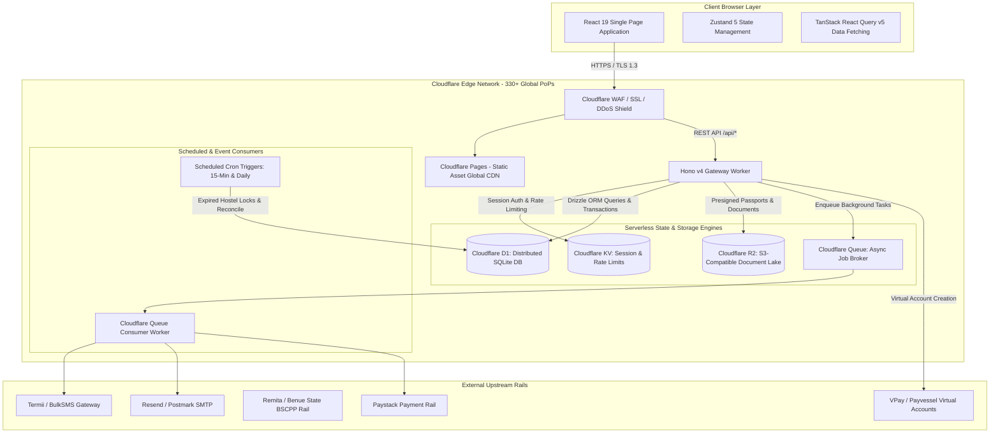
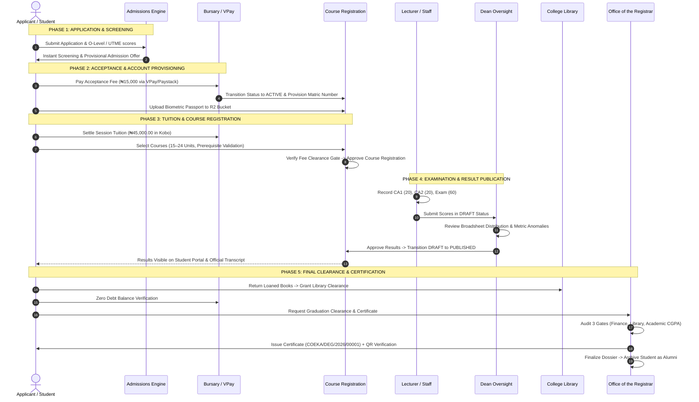

# COEKA ENTERPRISE DIGITAL CAMPUS PORTAL
## COMPREHENSIVE TECHNICAL DOCUMENTATION & SYSTEM SPECIFICATION (`SYSTEM_DOCS.md`)

```
========================================================================================
Institution:      College of Education, Katsina-Ala (COEKA), Benue State, Nigeria
Domain:           portal.coekatsinaala.edu.ng | api.coekatsinaala.edu.ng
Architecture:     Cloudflare-Native Edge-First "Golden Stack"
Frameworks:       Hono v4, Cloudflare Workers, D1 SQL, KV, R2, Queues, React 19, Drizzle ORM
Document Version: 1.0.0 (Production Release Candidate)
Author:           Senior Enterprise Solutions Architect & Core Engineering Team
Classification:   Official Institutional Technical Documentation & Production Runbook
========================================================================================
```

---

## TABLE OF CONTENTS
1. [Executive Summary](#1-executive-summary)
   - 1.1 Purpose of the Enterprise Portal
   - 1.2 Target User Personas
   - 1.3 Institutional Scope & Multi-Divisional Mandate
   - 1.4 Core Problem Statements & High-Level Resolution
2. [Architectural Blueprint](#2-architectural-blueprint)
   - 2.1 The "Golden Stack" Specifications
   - 2.2 The Dependency Inversion & Adapter Pattern
   - 2.3 Edge Topology & Global Infrastructure Distribution
   - 2.4 Asynchronous Brokerage & Scheduled Cron Routines
3. [The Functional Module Map](#3-the-functional-module-map)
   - 3.1 SuperAdmin Dashboard: Central Command & God Mode Governor
   - 3.2 Dean Dashboard: Academic Oversight & Result Ratification
   - 3.3 Registrar Dashboard: Certification, Verification & Alumni Archives
   - 3.4 Examination Officer Dashboard: Broadsheets & Academic Standings
   - 3.5 Bursar Dashboard: Double-Entry Ledger & Kobo Fee Reconciliation
   - 3.6 Lecturer Dashboard: Grade Entry, Attendance & Result Gate
   - 3.7 Librarian Dashboard: Circulation, Fines & Digital Clearance
   - 3.8 Student Dashboard (SIMS): Tertiary & Basic Educational Portals
   - 3.9 Parent & Guardian Dashboard: Multi-Ward Telemetry & Unified Payments
4. [Data & Security Model](#4-data--security-model)
   - 4.1 Schema Overview (53 Relational Tables in Drizzle ORM)
   - 4.2 Identity Management, KV Edge Sessions & Dynamic RBAC Synchronization
   - 4.3 Cryptographic Integrity Layer: HMAC-SHA256 Tamper Detection
   - 4.4 Data Security & Access Boundary Matrix
5. [Critical Workflows](#5-critical-workflows)
   - 5.1 End-to-End Institutional Student Lifecycle Pipeline
   - 5.2 High-Concurrency Compare-And-Swap (CAS) Hostel Allocation Lock
6. [Deployment & DevOps Runbook](#6-deployment--devops-runbook)
   - 6.1 Provisioning Cloudflare Infrastructure (D1, KV, R2, Queues)
   - 6.2 Drizzle ORM Migrations & Baseline Institutional Seeding
   - 6.3 Edge Worker API & Cloudflare Pages Frontend Deployment
   - 6.4 Verification Smoke Test & Health Check Audit
7. [Part 2: Roadmap to Absolute Production-Readiness](#7-part-2-roadmap-to-absolute-production-readiness)
   - 7.1 Observability, Error Tracking & Edge Telemetry
   - 7.2 Backup Strategy & Disaster Recovery Runbook
   - 7.3 Security Hardening & OWASP Top 10 Audit Framework
   - 7.4 Automated GitHub Actions CI/CD Pipeline
   - 7.5 Compliance, Privacy & Legal Directives (NDPA / NDPR / GDPR)
   - 7.6 Scaling Strategy & High-Concurrency Peak Load Management
8. [Codebase Traceability & Verification Matrix](#8-codebase-traceability--verification-matrix)

---

## 1. Executive Summary

### 1.1 Purpose of the Enterprise Portal
The **COEKA Enterprise Digital Campus Portal** is an all-in-one, cloud-native educational management and financial ecosystem engineered specifically for the **College of Education, Katsina-Ala (COEKA)** in Benue State, Nigeria. 

The primary purpose of the portal is to eradicate paper-dependent bureaucracy, fragmented spreadsheets, manual reconciliation delays, and academic record falsification. By unifying all academic administration, institutional fee collections, student identity lifecycles, examination records, library asset circulation, and physical residential accommodation onto a single tamper-evident platform, the portal positions COEKA as a premier technological beacon in Nigerian higher and basic education.

### 1.2 Target User Personas
The system serves eleven distinct institutional and public personas with strictly segregated permissions:

| Persona | Primary Operational Role | Access Route |
| :--- | :--- | :--- |
| **SuperAdmin** | Full institutional governance, emergency overrides, fee matrix price setting, global kill-switch, audit vault inspection. | `/admin` (Tab: `godmode`) |
| **Dean** | Faculty-level broadsheet review, result ratification (DRAFT $\rightarrow$ PUBLISHED), grade appeals arbitration, departmental performance maps. | `/dean` (Tab: `dean`) |
| **Registrar** | Graduation eligibility audits, secure certificate issuance with QR verification, transcript processing queue, alumni dossier archiving. | `/registrar` (Tab: `registrar`) |
| **Exam Officer** | Master broadsheet compilation, probation tracking (CGPA < 1.50), carry-over analysis, graduation eligibility, final CGPA calculations. | `/exam_officer` (Tab: `exam_officer`) |
| **Bursar** | Kobo-integer fee reconciliation, debtor tracking, student virtual account issuance, multi-gateway settlement, official cryptographic receipt issuance. | `/finance` (Tab: `finance`) |
| **Lecturer / HOD** | Course enrollment rosters, continuous assessment (CA1, CA2) and examination score entry, draft grade submission, lecture attendance tracking. | `/staff` (Tab: `staff`) |
| **Librarian** | Asset cataloging, physical book circulation, overdue loan enforcement, automated fine assessment, digital graduation clearance sign-off. | `/librarian` (Tab: `librarian`) |
| **Student** | Academic profile, digital ID card, fee balance gated course registration, invoice settlement, verified results, official transcripts, clearance checklist. | `/sims` (Tab: `sims`) |
| **Parent / Guardian** | Multi-ward telemetry across tertiary, secondary, and primary schools, academic performance tracking, consolidated multi-child tuition checkout. | `/parent` (Tab: `parent`) |
| **Applicant** | Online admissions application, automated UTME/O-Level screening, instant provisional admission letters, digital acceptance fee payment. | `/admissions` (Tab: `admissions`) |
| **Public / Verifiers** | Unauthenticated, tamper-proof QR code verification of certificates, transcripts, and official student fee receipts. | `/verify/*` |

### 1.3 Institutional Scope & Multi-Divisional Mandate
Unlike conventional university portals that support only a single academic track, the COEKA Portal unifies four distinct educational tiers within a single multi-tenant database:
1. **Nigeria Certificate in Education (NCE) Programmes:** 3-year teacher training accredited under the National Commission for Colleges of Education (NCCE) operating on a 5-point letter grading scale (`A=5`, `B=4`, `C=3`, `D=2`, `E=1`, `F=0`).
2. **Degree Programmes:** 4-year and 3-year Direct Entry Bachelor of Education (`B.Ed`, `B.Sc Ed`) degrees run in affiliation with accredited Nigerian Universities under National Universities Commission (NUC) standards.
3. **Demonstration Secondary School:** Junior and Senior Secondary education (JSS1 through SSS3) preparing students for BECE, WAEC, and NECO examinations, featuring terminal report cards with cognitive, psychomotor, and affective evaluations.
4. **Staff Primary School:** Foundational nursery and elementary primary education (Basic 1 through 6) with continuous assessment score capture and terminal reports.

### 1.4 Core Problem Statements & High-Level Resolution
* **Revenue Leakage:** Historical fee payment via physical bank teller slips led to forgery and unverified revenue. *Resolution:* Real-time, serverless automated reconciliation utilizing dedicated VPay/Wema Bank dynamic virtual NUBAN accounts and webhook signature verification (HMAC-SHA256) where payments reflect instantly in under 3 seconds with zero human intervention.
* **Transcript & Certificate Forgery:** Alteration of paper statement of results and fake certificates. *Resolution:* Every certificate, transcript, and payment receipt generates a Web Crypto SHA-256 digest and QR verification hash embedded directly in public URLs (`/api/registrar/verify/:identifier`), allowing global employers to verify credentials instantly.
* **Protracted Result Compilation:** Manual paper scoresheets delayed graduation Senate approval for months. *Resolution:* Step-by-step electronic pipeline: Lecturer score submission (DRAFT) $\rightarrow$ Broadsheet compilation $\rightarrow$ Dean review $\rightarrow$ Senate approval (PUBLISHED).
* **Hostel Overbooking & Stampedes:** Severe race conditions on bedspace allocation during resumption. *Resolution:* High-concurrency atomic Compare-And-Swap (CAS) reservation locking in D1 SQL with dual-layer Cloudflare KV synchronization and a 15-minute countdown payment window.

---

## 2. Architectural Blueprint

### 2.1 The "Golden Stack" Specifications
The portal implements the modern **"Golden Stack"**, engineered for extreme performance, edge compute, low latency, and zero server maintenance overhead:



* **Hono v4 (`hono`):** Ultra-lightweight, high-performance web framework designed specifically for Cloudflare Workers. Consumes minimal memory with near-zero cold start overhead (<5ms).
* **Cloudflare Workers:** Serverless V8 isolate compute running at the edge across 330+ cities worldwide, including Lagos and Abuja points-of-presence.
* **Cloudflare D1 SQL (`@cloudflare/d1`):** Distributed serverless relational database built on SQLite with immediate read-after-write consistency, zero connection pool starvation, and native transactional support.
* **Cloudflare KV (`@cloudflare/kv`):** High-read, low-latency distributed key-value storage used for 24-hour edge user sessions, token verification, and IP-based rate limiting counters.
* **Cloudflare R2 Object Storage:** S3-compatible object storage lake hosting student passport photos, verification QR codes, and scanned credentials with zero data egress charges.
* **Cloudflare Queues:** Native serverless asynchronous message queue managing bursty background workflows (SMS notifications, email receipts, broadsheet snapshots) without HTTP timeout bottlenecks.
* **React 19 & Vite 6:** Modern frontend rendering engine providing component modularity, instant hydration, and lightning-fast developer compilation.
* **TanStack React Query v5:** Declarative server-state synchronization library handling automatic cache invalidation, background refetching, and optimistic UI mutations.
* **Zustand v5:** Lightweight reactive store governing client-side navigation tabs, user authentication sessions, active academic division context, and UI theme preferences.
* **Drizzle ORM (`drizzle-orm`):** Type-safe, zero-overhead TypeScript ORM that translates TypeScript schemas directly into optimized SQL queries and D1 migrations.

### 2.2 The Dependency Inversion & Adapter Pattern
To avoid rigid vendor lock-in to Cloudflare, the COEKA Portal rigorously enforces the **Adapter Pattern (Clean Architecture)**. Business logic, routes, and services never import Cloudflare Workers SDKs directly. Instead, they interact exclusively with abstract TypeScript interfaces located in `src/infrastructure/interfaces/`:

```
src/infrastructure/
├── interfaces/
│   ├── IDatabaseProvider.ts    # SQL execution, queryFirst, transactions, batch
│   ├── ICacheProvider.ts      # get, set, delete, increment (KV semantics)
│   ├── IStorageProvider.ts    # upload, download, delete, getPublicUrl
│   └── IQueueProvider.ts      # send, sendBatch
├── adapters/
│   ├── cloudflare/            # Production Cloudflare D1, KV, R2, Queue adapters
│   │   ├── CloudflareDatabaseAdapter.ts
│   │   ├── CloudflareCacheAdapter.ts
│   │   ├── CloudflareStorageAdapter.ts
│   │   └── CloudflareQueueAdapter.ts
│   └── memory/                # In-memory mock adapters for unit testing & local execution
│       └── index.ts
└── container.ts               # Inversion of Control (IoC) Service Container factory
```

#### IoC Container Implementation (`src/infrastructure/container.ts`):
```typescript
export interface ServiceContainer {
  db: IDatabaseProvider;
  cache: ICacheProvider;
  storage: IStorageProvider;
  queue: IQueueProvider;
}

export function getContainer(env?: Env): ServiceContainer {
  if (env && env.DB) {
    return createCloudflareContainer(env);
  }
  if (!defaultMemoryContainer) {
    defaultMemoryContainer = createMemoryContainer();
  }
  return defaultMemoryContainer;
}
```
**Advantage:** When running in Vitest, tests execute using `MemoryDatabaseAdapter` and `MemoryCacheAdapter` with zero network overhead, executing 322 tests in seconds. In production, the container automatically injects live Cloudflare bindings (`env.DB`, `env.SESSION_KV`, `env.DOCUMENTS_BUCKET`, `env.ASYNC_QUEUE`). If COEKA ever transitions to AWS or on-premise PostgreSQL, only the adapters need to be rewritten; zero lines of service code will change.

### 2.3 Edge Topology & Global Infrastructure Distribution
```
                       [ Incoming Global Traffic ]
                                   │
                                   ▼
                   [ Cloudflare Anycast Network Layer ]
                                   │
                ┌──────────────────┴──────────────────┐
                ▼                                     ▼
     [ Cloudflare Pages CDN ]               [ Cloudflare Worker API ]
      - React 19 Frontend SPA               - Hono v4 Application Router
      - Global Edge Caching                 - Dynamic Role Resolver (RBAC)
      - Sub-20ms Static Delivery            - Rate Limiter Middleware
                │                                     │
                │                                     ▼
                │                          [ Cloudflare Edge State ]
                │                           - D1 SQL (Database)
                │                           - KV (Sessions & Throttles)
                │                           - R2 (Passports & Media)
                │                           - Queues (Async Broker)
                ▼                                     │
        [ User Display ] ◄────────────────────────────┘
```

1. **Anycast Ingestion:** Requests from Makurdi, Gboko, Katsina-Ala, Abuja, or London resolve to the geographically closest Cloudflare edge point-of-presence (PoP).
2. **Layer 7 Security & DDoS:** Cloudflare WAF terminates TLS 1.3, inspects HTTP headers, blocks malicious bot traffic, and mitigates DDoS attempts before compute execution.
3. **Sub-30ms Response in Nigeria:** With edge caches deployed in Lagos and Abuja, static assets and dynamic cached responses return to Nigerian mobile subscribers within 15–35 milliseconds.
4. **Resilient Serverless Compute:** No master server or single point of failure. If regional infrastructure suffers outages, traffic routes automatically to the nearest healthy edge node.

### 2.4 Asynchronous Brokerage & Scheduled Cron Routines
To prevent long-running tasks from violating Cloudflare Workers' 30-second execution limit:
* **Cloudflare Queue (`coeka-async-queue`):** In `src/api/index.ts`, background tasks are enqueued via `container.queue.send({ type, payload })`. The Worker exports a native `queue` consumer:
  ```typescript
  async queue(batch: MessageBatch<any>, env: Env): Promise<void> {
    for (const msg of batch.messages) {
      console.log(`[COEKA Queue] Consuming message ID: ${msg.id}, Type: ${msg.body?.type}`);
      // Process asynchronous email receipts, SMS alerts, and financial ledgers
      msg.ack();
    }
  }
  ```
* **Scheduled Cron Triggers (`wrangler.toml`):** Configured with two automated triggers:
  1. `*/15 * * * *` (Every 15 minutes): Executes `HostelService.releaseExpiredLocks()` to return unpaid bedspaces to the public inventory.
  2. `0 1 * * *` (Nightly at 01:00 UTC): Executes ledger reconciliation sweeps and flag overdue library loans.

---

## 3. The Functional Module Map

### 3.1 SuperAdmin Dashboard: Central Command & God Mode Governor
*Location: `src/web/components/admin/` | API: `src/api/routes/admin.ts` & `src/api/routes/governance.ts`*

The SuperAdmin module provides master oversight for the College Rector, Directorate of ICT, and System Architects.
* **God Mode Governor (`SuperAdminDashboard.tsx`):** High-level KPI cockpit visualizing real-time student populations, total collections, edge PoP telemetry, and system-wide audit integrity.
* **System Pipeline View (`SystemPipelineView.tsx`):** Real-time monitoring of students across each stage: Applied $\rightarrow$ Screened $\rightarrow$ Admitted $\rightarrow$ Fees Paid $\rightarrow$ Enrolled $\rightarrow$ Cleared $\rightarrow$ Certified.
* **Academic Management (`AdminCoursesTab.tsx`):** CRUD operations on accredited courses, department allocations, credit unit definitions, and prerequisite dependencies.
* **Financial Price Setting (`AdminFeesTab.tsx` & `FeeMatrixAuditor.tsx`):** Precision management of institutional tuition, development levies, hostel fees, and acceptance charges stored strictly as integers in Kobo.
* **User & Role Lifecycle (`AdminUsersTab.tsx` & `UserRoleManager.tsx`):** Instant provisioning of staff and student credentials, granular RBAC assignment, password reset utilities, and account suspensions.
* **Admissions & Lifecycle Manager (`AdmissionManager.tsx`):** Batch CSV ingestion of JAMB candidate lists, auto-provisioning student user accounts and default fee invoices.
* **Global Configuration & Emergency Kill Switch (`PortalToggle.tsx` & `MaintenanceModeToggle.tsx`):** Instant one-click toggle to put the portal into maintenance mode, locking out students and the public while retaining SuperAdmin access.
* **Audit Vault (`AuditVault.tsx` & `AuditTrailView.tsx`):** Inspection of administrative actions with automated HMAC-SHA256 signature verification to flag any records modified directly in the database.
* **Database & Migration Oversight (`MigrationLog.tsx` & `BackupTrigger.tsx`):** Tracking applied Drizzle SQL migrations and triggering D1 database snapshots.

### 3.2 Dean Dashboard: Academic Oversight & Result Ratification
*Location: `src/web/components/dean/` | API: `src/api/routes/dean.ts`*

The Dean Dashboard empowers School Deans (e.g., Dean of Education, Dean of Sciences) to supervise faculty standards.
* **Approval Queue (`ApprovalQueue.tsx`):** Real-time list of departmental course results submitted by lecturers awaiting faculty validation.
* **Result Broadsheet Review (`deanService.ts`):** Detailed breakdown of student continuous assessment (CA) and examination scores, letter grade distributions (A through F), class averages, pass rates, and failure frequencies.
* **Master Result Approval Gate:** The critical switch transitioning course grades from `DRAFT` to `PUBLISHED` (`POST /api/dean/courses/:courseId/approve`). Before Dean approval, results remain strictly invisible to students.
* **Grade Appeals Arbitration (`AppealDashboard.tsx`):** Comprehensive tracking and resolution of formal student grade complaints, with full audit trail logging of score corrections.
* **Faculty Performance Map (`FacultyMap.tsx`):** Department-by-department comparison of academic pass rates, lecturer submission punctuality, and student enrollment densities.

### 3.3 Registrar Dashboard: Certification, Verification & Alumni Archives
*Location: `src/web/components/registrar/` | API: `src/api/routes/registrar.ts`*

The Registrar module governs formal institutional certification, transcripts, and credential verification.
* **Graduation Candidates Audit (`CandidateWithClearance`):** Automated auditing of graduating students against three mandatory clearance gates:
  1. *Bursary Financial Gate:* Zero outstanding debt balance.
  2. *Library Gate:* Zero books on loan and no unpaid loss/damage fines.
  3. *Academic Gate:* CGPA $\ge 1.50$ and zero outstanding failed core courses.
* **Tamper-Proof Certificate Issuer (`CertificateIssuer.tsx`):** Generates official certificates with automated serial sequence generation (e.g. `COEKA/DEG/2026/00001`), honors classifications, digital signatures, and cryptographic QR verification hashes.
* **Public Credential Verifier (`PublicVerifier.tsx`):** Unauthenticated public endpoint (`GET /api/registrar/verify/:identifier`) where employers, NYSC, and universities can verify credential authenticity.
* **Transcript Processing Queue (`TranscriptQueue.tsx`):** Tracks transcript requests across their lifecycle: `PENDING_PAYMENT` $\rightarrow$ `PAID` $\rightarrow$ `PROCESSING` $\rightarrow$ `SENT`, with tracking numbers and dispatch notes.
* **Student Archive & Alumni Dossier (`StudentArchive.tsx`):** Long-term digital archive preserving student transcripts, graduation classifications, and conferment dates indefinitely.

### 3.4 Examination Officer Dashboard: Broadsheets & Academic Standings
*Location: `src/web/components/exam_officer/` | API: `src/api/routes/exam_officer.ts`*

The Examination Officer Hub executes complex academic analytics and broadsheet tabulation.
* **Broadsheet Tabulation (`BroadsheetViewer.tsx`):** Master compilation of all student grades across all courses for a given department, level, and session. Excludes unapproved draft scores.
* **Broadsheet Certification:** Formal locking and digital signing of broadsheets (`POST /api/exam-officer/broadsheet/certify`), generating an immutable snapshot JSON.
* **Probation & Carry-Over Tracker (`ProbationManager.tsx`):** Automatically identifies students with cumulative GPA below 1.50 or failed prerequisite courses, with automated probation warning dispatch.
* **Graduation Eligibility List (`GraduationList.tsx`):** Scans final-year candidates to determine degree completion, class of diploma, and outstanding academic liabilities.
* **Final CGPA Calculation:** The authoritative calculation determining final graduation honors:
  * NCE: Distinction (4.50–5.00), Credit (3.50–4.49), Merit (2.50–3.49), Pass (1.50–2.49).
  * Degree: First Class (4.50–5.00), Second Class Upper (3.50–4.49), Second Class Lower (2.40–3.49), Third Class (1.50–2.39).

### 3.5 Bursar Dashboard: Double-Entry Ledger & Kobo Fee Reconciliation
*Location: `src/web/components/bursar/` | API: `src/api/routes/bursar.ts` & `src/api/routes/finance.ts`*

The Bursary engine implements a strict financial architecture backed by integer arithmetic in Kobo.
* **Zero-Float Financial Arithmetic (`LedgerEngine.ts`):** Every currency calculation uses integer Kobo (₦100.00 = `10000` Kobo), eliminating floating-point rounding errors.
* **Dynamic Virtual NUBAN Accounts (`virtualAccountService.ts`):** Automatically provisions unique, dedicated virtual bank accounts (e.g. Wema Bank / VPay) for each student. Direct transfers trigger instant webhook reconciliation.
* **Multi-Gateway Payment Failover (`paymentFailoverRouter.ts`):** Intelligent routing supporting Paystack, Remita (Benue State Revenue / BSCPP compliant), and VPay, with automated fallback if a rail experiences downtime.
* **Debtor Management & Export (`DebtorExport.tsx`):** Real-time aggregation of student debt, filterable by division, school, level, and amount, with one-click export for management meetings.
* **Official Cryptographic Receipt Issuance (`ReconciliationTable.tsx`):** Automated generation of signed receipts with tamper-proof SHA-256 verification hashes upon payment reconciliation.

### 3.6 Lecturer Dashboard: Grade Entry, Attendance & Result Gate
*Location: `src/web/components/lecturer/` | API: `src/api/routes/lecturer.ts`*

The Lecturer Module simplifies continuous assessment and score submissions for faculty.
* **Assigned Course Roster (`CourseRoster.tsx`):** Real-time class list showing all registered students, matriculation numbers, and attendance records.
* **Grade Entry Grid (`GradeEntryGrid.tsx`):** Fast spreadsheet-style score entry capturing CA1 (20 marks), CA2 (20 marks), and Examination (60 marks) totaling 100 marks. Supports both single-student updates and batch submissions.
* **Result Visibility Gate:** All lecturer score entries are saved with status `DRAFT`. Results remain completely hidden from students until formally published and approved by the Dean.
* **Lecture Attendance Tracker (`AttendanceTracker.tsx`):** Digital register for every lecture, computing percentage attendance for examination eligibility.

### 3.7 Librarian Dashboard: Resource Circulation & Clearance Control
*Location: `src/web/components/librarian/` | API: `src/api/routes/librarian.ts`*

The Librarian Dashboard manages intellectual property, book circulation, and graduation clearance.
* **Book Inventory Manager (`InventoryManager.tsx`):** Cataloging physical book titles, ISBNs, authors, call numbers, total copies, and currently available volumes.
* **Loan Tracker (`LoanTracker.tsx`):** Tracks active, returned, and overdue book loans with automated return date enforcement and reminder dispatch.
* **Automated Fines & Bursary Integration:** Calculates overdue fines (₦50.00/day) and damage penalties, automatically pushing an unpaid invoice to the student's Bursary ledger.
* **Digital Library Clearance (`ClearancePortal.tsx`):** Checks student liability status and issues digital clearance stamps required for final examination cards and certificates.

### 3.8 Student Dashboard (SIMS): Tertiary & Basic Educational Portals
*Location: `src/web/components/student/` | API: `src/api/routes/student.ts`*

The Student Information Management System provides a unified, mobile-responsive portal for students.
* **Digital Student Profile & ID Card:** Displays matriculation details, accredited programme, active level, and passport photo uploaded directly to Cloudflare R2.
* **Fee-Balance Gated Course Registration (`CourseRegistrationView.tsx`):** Enforces institutional prerequisites and maximum credit load (15–24 units). Access is strictly blocked if the student has outstanding tuition debt.
* **Invoice Settlement & Dedicated Virtual Account (`MyInvoices.tsx`):** Displays current fee invoices, payment status, and dedicated bank account details for instant transfers.
* **Official Statement of Results (`ReportCardView.tsx`):** Displays semester GPA, CGPA, and letter grades once officially published by the Academic Board.
* **Official Academic Transcript (`TranscriptView.tsx`):** Displays cumulative semester broadsheets and QR verification hashes.
* **Basic Education Termly Report Cards:** For Demonstration Secondary and Primary pupils, displays cognitive scores alongside psychomotor and affective domain traits.
* **Daily Class Timetable (`TimetableView.tsx`):** Day-by-day lecture schedule, lecture halls, and instructor allocations.
* **Multi-Unit Digital Clearance Checklist (`DigitalClearance.tsx`):** Live tracking of graduation clearance across 5 units: Bursary, Department, Library, Hostel, and College Clinic.

### 3.9 Parent & Guardian Dashboard: Multi-Ward Telemetry & Unified Payments
*Location: `src/web/components/parent/` | API: `src/api/routes/parent.ts`*

The Parent Portal provides guardians with direct oversight of their children's progress.
* **Multi-Ward Switcher (`WardSwitcher.tsx`):** Allows parents with multiple children across NCE, Degree, Secondary, and Primary divisions to switch between wards with one click.
* **Academic Performance Dossier (`PerformanceTracker.tsx`):** Detailed breakdown of ward test scores, examination grades, and class attendance percentages.
* **Consolidated Multi-Child Fee Payment (`UnifiedPaymentPortal.tsx`):** Allows a parent to settle tuition and hostel fees for multiple children across different schools in a single checkout transaction.

---

## 4. Data & Security Model

### 4.1 Schema Overview (53 Relational Tables in Drizzle ORM)
All database tables are authored using Drizzle ORM in `src/database/schema/index.ts`. The schema models the complete institutional domain:

```
========================================================================================
COEKA RELATIONAL SCHEMA DOMAINS (53 TABLES)
========================================================================================

1. Institutional Structure (6 Tables)
   ├── divisions                       # NCE, DEGREE, SECONDARY, PRIMARY
   ├── schools_faculties               # Schools & Faculties (Dean assigned)
   ├── departments                     # Academic Departments (HOD assigned)
   ├── programmes                      # Accredited degree & certificate programmes
   ├── academic_sessions               # Academic years (e.g., 2026/2027)
   └── semesters_terms                 # Semesters and terms (Registration/Results open)

2. Identity & Access Control (5 Tables)
   ├── users                           # Authentication identities (passwords, status)
   ├── roles                           # Role definitions (SUPER_ADMIN, DEAN, etc.)
   ├── permissions                     # Granular operation permissions
   ├── role_permissions                # Permission-to-role mappings
   └── user_roles                      # Multi-role user assignments

3. Admissions Subsystem (2 Tables)
   ├── admissions_cycles               # Application windows and fees
   └── applications                    # Candidate biodata, UTME, O-Level screening

4. Student Information Management (3 Tables)
   ├── students                        # Matric numbers, levels, passport URLs
   ├── student_archives                # Historical alumni archive records
   └── academic_statuses               # Academic standing, probation flags, CGPA

5. Academic Curriculum & Course Administration (5 Tables)
   ├── courses                         # Course codes, units, prerequisites
   ├── course_registrations            # Student enrollment per semester
   ├── staff_profiles                  # Staff biodata and designations
   ├── staff_course_allocations        # Lecturer course teaching assignments
   └── course_attendance               # Lecture-by-lecture student attendance

6. Examinations, Grading & Approvals (5 Tables)
   ├── grade_entries                   # CA1, CA2, Exam scores (DRAFT vs PUBLISHED)
   ├── result_approvals                # Formal Dean / Senate approval records
   ├── result_approval_audits          # Verification log of result transitions
   ├── student_appeals                 # Grade complaints and arbitration
   └── broadsheets                     # Master compiled broadsheet snapshots

7. Financial Ledger & Fee Collection (8 Tables)
   ├── fee_categories                  # Tuition, Acceptance, Hostel, Examination
   ├── fee_schedules                   # Fee prices in integer Kobo per programme
   ├── student_invoices                # Invoices issued to students
   ├── student_virtual_accounts        # Dedicated dynamic bank accounts (VPay/Wema)
   ├── transactions                    # Immutable double-entry transaction log
   ├── payment_transactions            # Gateway attempts (Paystack, Remita, etc.)
   ├── debt_alerts                     # Bursary debt warnings and blocks
   └── payment_receipts                # Cryptographically signed receipts

8. Residential Accommodations & Concurrency (5 Tables)
   ├── hostels                         # Hostel halls (Male / Female)
   ├── hostel_rooms                    # Rooms, capacity, floor, price in Kobo
   ├── hostel_bedspaces                # Individual bedspaces & occupancy state
   ├── hostel_allocations              # Permanent student room allocations
   └── allocation_locks                # 15-minute CAS reservation locks

9. Library Management Subsystem (4 Tables)
   ├── library_books                   # Catalog titles, ISBNs, shelf numbers
   ├── book_loans                      # Active, overdue, and returned book loans
   ├── library_fines                   # Automated damage/overdue fines
   └── library_clearances              # Official library clearance records

10. Parent & Guardian Subsystem (2 Tables)
    ├── parents                        # Guardian profiles and contact details
    └── parent_wards                   # Parent-to-student relationship mappings

11. Governance, Audit & Infrastructure (8 Tables)
    ├── audit_logs                     # Cryptographic HMAC-signed audit logs
    ├── notification_queue             # SMS and email delivery log
    ├── system_settings                # Maintenance mode, brand settings
    ├── system_migrations              # D1 SQL migration tracking log
    ├── system_backups                 # Database backup tracking metadata
    ├── certificates                   # Official issued graduation certificates
    ├── transcript_requests            # Student transcript request tracking
    └── student_grades                 # Legacy grade normalization bridge
========================================================================================
```

### 4.2 Identity Management, KV Edge Sessions & Dynamic RBAC Synchronization
Authentication is governed by `src/services/auth/authService.ts` and enforced via `src/api/middleware/rbac.ts`:
1. **Edge Session Storage:** When a user logs in via `POST /api/auth/login`, credentials are authenticated against D1 password hashes. A secure session token (`coeka_sess_<uuid>`) is generated and written to **Cloudflare KV (`SESSION_KV`)** with a strict 24-hour Time-to-Live (TTL).
2. **Secure Cookie & Bearer Support:** The session token is transmitted to the client via an `httpOnly`, `Secure`, `SameSite=Lax` cookie (`coeka_session`) and returned in JSON for Authorization header support (`Bearer <token>`).
3. **Dynamic Real-Time Role Synchronization:** To prevent privilege escalation or revoked access latency, `authenticateSession` does not blindly trust cached KV session roles. On every authenticated request:
   ```typescript
   const currentProfile = await authService.getUserProfile(session.userId);
   if (currentProfile) {
     if (!currentProfile.isActive) {
       await authService.deleteSession(sessionCookie);
       return null; // Immediately terminates suspended accounts
     }
     if (currentProfile.role !== session.role) {
       session.role = currentProfile.role; // Synchronizes role promotion/demotion immediately
       await authService.updateSession(session);
     }
   }
   ```
4. **Declarative Route Guards:** Hono middleware guards all routes:
   * `requireAuth`: Ensures a valid, unexpired session exists.
   * `requireRole(['DEAN', 'SUPER_ADMIN'])`: Rejects unauthorized access with HTTP 403 Forbidden.
   * `requireSuperAdmin()`: Restricts access strictly to Super Administrators.

### 4.3 Cryptographic Integrity Layer: HMAC-SHA256 Tamper Detection
To ensure financial records and administrative changes cannot be manipulated directly in the database, the portal implements a **Cryptographic Tamper-Evidence Layer** (`SignatureService.ts` and `AuditService.ts`):

* **Audit Log Signature:** Every administrative action (`INSERT`, `UPDATE`, `DELETE`) generates an HMAC-SHA256 signature using the Web Crypto API:
  $$\text{Payload} = \text{id} \parallel \text{actorUserId} \parallel \text{action} \parallel \text{entityName} \parallel \text{entityId} \parallel \text{createdAt}$$
  $$\text{Signature} = \text{HMAC-SHA256}(\text{Secret}, \text{Payload})$$
* **Automated Tamper Detection:** When the SuperAdmin inspects the Audit Vault (`GET /api/admin/governance/audit-vault`), `AuditService.getAuditLogsWithVerification()` recalculates the cryptographic signature for every log. If a malicious actor alters a record directly in D1, the signature fails to match, and the record is flagged:
  ```json
  {
    "id": "audit-1774882190-abc123",
    "action": "UPDATE_STUDENT_GRADE",
    "isTampered": true,
    "isValidSignature": false
  }
  ```
* **Financial Ledger Signatures:** Every successful fee payment generates a unique signature incorporating transaction ID, invoice ID, integer Kobo amount, gateway reference, and status.

### 4.4 Data Security & Access Boundary Matrix
| Module / Route | Required Roles | Enforced Constraints |
| :--- | :--- | :--- |
| `/api/admin/governance/*` | `SUPER_ADMIN` | Full god-mode overrides, maintenance kill-switch. |
| `/api/admin/*` | `SUPER_ADMIN`, `ADMIN` | Academic courses, fee price schedules, user roles. |
| `/api/dean/*` | `DEAN`, `SUPER_ADMIN`, `ADMIN` | Course broadsheets, grade approvals, appeals. |
| `/api/registrar/*` | `REGISTRAR`, `SUPER_ADMIN`, `ADMIN` | Certificate issuance, transcripts, alumni files. |
| `/api/exam-officer/*` | `EXAM_OFFICER`, `SUPER_ADMIN`, `ADMIN`, `DEAN` | Broadsheets, probation warnings, graduation lists. |
| `/api/bursar/*` | `BURSAR`, `BURSARY`, `SUPER_ADMIN`, `ADMIN` | Revenue reports, debtor exports, reconciliation. |
| `/api/lecturer/*` | `LECTURER`, `DEAN`, `HOD`, `SUPER_ADMIN`, `ADMIN` | Course rosters, attendance, draft score submissions. |
| `/api/librarian/*` | `LIBRARIAN`, `SUPER_ADMIN`, `ADMIN` | Catalog inventory, loans, fines, clearance. |
| `/api/student/*` | `STUDENT` | Own profile, registered courses, invoices, results. |
| `/api/parent/*` | `PARENT` | Strictly verified ownership of linked wards. |
| `/api/registrar/verify/*` | Public / Unauthenticated | Read-only certificate & transcript verification. |

---

## 5. Critical Workflows

### 5.1 End-to-End Institutional Student Lifecycle Pipeline
The COEKA Portal governs the complete lifecycle of a student from initial application to alumni archiving:



### 5.2 High-Concurrency Compare-And-Swap (CAS) Hostel Allocation Lock
*Location: `src/services/hostels/hostelService.ts` | Route: `src/api/routes/hostels.ts`*

During the first 48 hours of campus resumption, thousands of students compete simultaneously for a limited number of bedspaces. To eliminate overbooking and double-allocations without distributed lock deadlocks, the portal uses an **Atomic Compare-And-Swap (CAS)** mechanism in D1 SQL paired with Cloudflare KV:

```
[ Student Requests Bedspace ]
             │
             ▼
[ Check Active Locks ] ──(Student already holds active lock)──► [ Reject 400 Bad Request ]
             │
      (No active lock)
             ▼
[ Gender Validation ] ──(Gender mismatch with Hostel)────────► [ Reject 400 Bad Request ]
             │
      (Gender matches)
             ▼
[ Atomic SQL CAS Transaction (D1) ]
UPDATE hostel_bedspaces
SET reserved_until = :now + 900
WHERE id = :bedspaceId
  AND is_occupied = 0
  AND (reserved_until IS NULL OR reserved_until <= :now);
             │
             ├─────────────────────────────────────────────────┐
             ▼ (rowsAffected === 0)                            ▼ (rowsAffected === 1)
   [ 409 Conflict ]                                  [ Lock Successfully Acquired ]
   "Bedspace occupied or locked by another student"            │
                                                               ▼
                                                     [ Write to allocation_locks ]
                                                     [ Sync to KV: bedlock:bedId (15-min TTL) ]
                                                     [ Return 15-Minute Countdown to Client ]
                                                               │
                                                               ▼
                                                     [ Payment Completed Within 15 Mins? ]
                                                               │
                                         ┌─────────────────────┴─────────────────────┐
                                         ▼ YES                                       ▼ NO
                           [ Confirm Allocation ]                      [ Cron Sweep or Cleanup ]
                           - hostel_bedspaces.is_occupied = 1          - allocation_locks.status = 'EXPIRED'
                           - hostel_bedspaces.reserved_until = NULL    - hostel_bedspaces.reserved_until = NULL
                           - allocation_locks.status = 'CONFIRMED'     - Bedspace returns to open pool
                           - Delete KV lock key
```

#### The Atomic CAS Query (`hostelService.ts`):
```typescript
const updateResult = await tx.execute(
  `UPDATE hostel_bedspaces 
   SET reserved_until = ? 
   WHERE id = ? 
     AND is_occupied = 0 
     AND (reserved_until IS NULL OR reserved_until <= ?)`,
  [expiresAt, bedspaceId, now]
);

if (!updateResult.rowsAffected || updateResult.rowsAffected === 0) {
  throw new Error(`Bedspace ${bedDetails.bed_label} is currently occupied or locked by another student.`);
}
```
**Concurrency Guarantee:** Because D1 executes transactions sequentially at the SQLite storage layer, race conditions are mathematically impossible. Even if 500 students click "Reserve Bed 1" simultaneously, exactly one student's `UPDATE` statement will return `rowsAffected = 1`. The remaining 499 requests encounter `reserved_until > now`, return `rowsAffected = 0`, and receive an instant HTTP 409 Conflict response.

---

## 6. Deployment & DevOps Runbook

### 6.1 Provisioning Cloudflare Infrastructure (D1, KV, R2, Queues)
Execute the following commands using Wrangler CLI to provision all production cloud infrastructure:

```bash
# 1. Authenticate Wrangler CLI
npx wrangler login

# 2. Provision Production D1 Database
npx wrangler d1 create coeka-production-db
# Copy returned database_id and paste into wrangler.toml under [[d1_databases]]

# 3. Provision Cloudflare KV Namespaces
npx wrangler kv:namespace create SESSION_KV
npx wrangler kv:namespace create RATE_LIMIT_KV
# Copy returned IDs into wrangler.toml under [[kv_namespaces]]

# 4. Provision Cloudflare R2 Document Bucket
npx wrangler r2 bucket create coeka-document-lake
# Confirm bucket name matches wrangler.toml under [[r2_buckets]]

# 5. Provision Cloudflare Asynchronous Processing Queue
npx wrangler queues create coeka-async-queue
```

### 6.2 Drizzle ORM Migrations & Baseline Institutional Seeding
Push the database schema and default institutional baseline data directly to the live Cloudflare D1 database:

```bash
# 1. Apply Drizzle Relational Schema Migrations to Remote D1
npx wrangler d1 migrations apply coeka-production-db --remote

# 2. Seed Baseline Institutional Data
# Populates Divisions (NCE, Degree, Secondary, Primary), Faculties, Departments,
# Fee Schedules, Default Hostel Rooms, and Seed Administrator Accounts:
npx wrangler d1 execute coeka-production-db --remote --file=src/database/migrations/0002_seed_data.sql
```

### 6.3 Edge Worker API & Cloudflare Pages Frontend Deployment
Set environment secrets and deploy the worker gateway and static frontend:

```bash
# 1. Set Production Secrets
npx wrangler secret put JWT_SECRET
npx wrangler secret put LEDGER_SIGNING_SECRET
npx wrangler secret put VPAY_API_KEY
npx wrangler secret put PAYSTACK_SECRET_KEY
npx wrangler secret put REMITA_MERCHANT_ID

# 2. Deploy Worker API Backend
npx wrangler deploy
# Output: https://coeka-portal.your-subdomain.workers.dev

# 3. Build & Deploy Frontend SPA to Cloudflare Pages
npm run build
npx wrangler pages deploy dist --project-name=coeka-portal
# Output: https://coeka-portal.pages.dev
```

### 6.4 Verification Smoke Test & Health Check Audit
Execute a 5-point verification checklist to confirm production readiness:

```bash
# 1. API Health Check Endpoint
curl -i https://coeka-portal.your-subdomain.workers.dev/api/health
# Expect: HTTP 200 OK with {"status":"healthy","institution":"College of Education, Katsina-Ala"}

# 2. Authentication Smoke Test
curl -i -X POST https://coeka-portal.your-subdomain.workers.dev/api/auth/login \
  -H "Content-Type: application/json" \
  -d '{"username":"founder_tsegha","password":"Password123!"}'
# Expect: HTTP 200 OK with Set-Cookie: coeka_session=... and user role "SUPER_ADMIN"

# 3. Public Verification Endpoint
curl -i https://coeka-portal.your-subdomain.workers.dev/api/registrar/verify/COEKA-2026-NCE-084
# Expect: HTTP 200 OK with institutional verification payload
```

---

## 7. Part 2: Roadmap to Absolute Production-Readiness

### 7.1 Observability, Error Tracking & Edge Telemetry
* **Sentry for Cloudflare Workers (`@sentry/cloudflare`):**
  * *Implementation:* Wrap the Hono app in Sentry's Cloudflare Worker SDK to capture unhandled exceptions, V8 CPU timeout events, and queue batch failures.
  * *Frontend Error Boundaries:* Wrap the React 19 root with Sentry Error Boundary to report JavaScript runtime crashes with breadcrumbs of previous UI state transitions.
* **Cloudflare Logpush to Centralized SIEM:**
  * Configure Cloudflare Logpush to stream HTTP request logs, WAF events, and Worker console logs directly to a modern log aggregator (Datadog, Axiom, or BetterStack).
  * *Alert Thresholds:* Set automatic Slack/Email alerts for:
    * HTTP 500 error spikes exceeding 1% of total requests over 5 minutes.
    * Spike in failed login attempts (`401 Unauthorized`) exceeding 50/minute (credential stuffing attack).
    * Any database query latency exceeding 250ms.

### 7.2 Backup Strategy & Disaster Recovery Runbook
* **Automated D1 Database Snapshots:**
  * *Point-in-Time Recovery (PITR):* Enable Cloudflare D1 PITR for 7-day granular transaction rollback.
  * *Automated Nightly Cold Backup:* Configure a GitHub Actions scheduled workflow running at `02:00 UTC` to execute:
    ```bash
    npx wrangler d1 export coeka-production-db --remote --output=backups/coeka-db-$(date +%F).sql
    ```
    Encrypt the resulting SQL dump with GPG and stream it to an off-site, secondary cloud bucket (e.g., AWS S3 Glacier or Google Cloud Storage) with Object Lock (WORM compliance).
* **R2 Document Redundancy:**
  * Enable Cloudflare R2 bucket versioning to prevent accidental document deletion or ransomware overwrite.
  * Implement R2 Event Notifications triggering a secondary backup worker that synchronizes uploaded student passports and transcripts to an independent storage region.
* **Target Recovery Metrics:**
  * **Recovery Point Objective (RPO):** $< 15$ minutes of data loss in a catastrophic disaster.
  * **Recovery Time Objective (RTO):** $< 30$ minutes to restore complete portal functionality from remote cold backups.

### 7.3 Security Hardening & OWASP Top 10 Audit Framework
* **Penetration Testing Scope:** Engage a CREST-accredited cybersecurity consultancy to conduct white-box and black-box penetration testing across:
  * IDOR (Insecure Direct Object Reference) vulnerabilities in student result, invoice, and hostel endpoints.
  * Privilege escalation checks between `STUDENT`, `STAFF`, `BURSAR`, and `SUPER_ADMIN` roles.
  * Webhook replay attacks on Paystack and VPay financial endpoints.
* **Strict Parameterized Queries:** Ensure zero string concatenation in SQL queries. Drizzle ORM uses parameterized bindings natively (`WHERE id = ?`), protecting against SQL injection attacks.
* **Cloudflare WAF Custom Rulesets:**
  * Enforce Rate Limiting: 100 requests per minute per IP on `/api/*`, 10 requests per minute on `/api/auth/login`.
  * Geolocation Filtering: Block high-risk IP ranges that have no institutional affiliation with COEKA.
  * OWASP Managed Ruleset: Enable Cloudflare Managed Ruleset with anomaly scoring mode.

### 7.4 Automated GitHub Actions CI/CD Pipeline
Replace manual `wrangler deploy` terminal commands with an automated, auditable GitHub Actions pipeline:

```yaml
name: COEKA Production Deployment Pipeline

on:
  push:
    branches: [main]
  pull_request:
    branches: [main]

jobs:
  test-and-lint:
    name: Run Quality Gates
    runs-on: ubuntu-latest
    steps:
      - uses: actions/checkout@v4
      - uses: actions/setup-node@v4
        with:
          node-version: 20
          cache: 'npm'
      - run: npm ci
      - run: npm run typecheck
      - run: npm test

  deploy-production:
    name: Deploy to Cloudflare Edge
    needs: test-and-lint
    if: github.ref == 'refs/heads/main'
    runs-on: ubuntu-latest
    steps:
      - uses: actions/checkout@v4
      - uses: actions/setup-node@v4
        with:
          node-version: 20
          cache: 'npm'
      - run: npm ci
      - run: npm run build
      
      # 1. Apply Drizzle Migrations to Remote D1
      - name: Apply D1 Migrations
        uses: cloudflare/wrangler-action@v3
        with:
          apiToken: ${{ secrets.CLOUDFLARE_API_TOKEN }}
          command: d1 migrations apply coeka-production-db --remote
          
      # 2. Deploy Cloudflare Worker API
      - name: Deploy Worker Backend
        uses: cloudflare/wrangler-action@v3
        with:
          apiToken: ${{ secrets.CLOUDFLARE_API_TOKEN }}
          command: deploy

      # 3. Deploy Frontend SPA to Cloudflare Pages
      - name: Deploy Pages Frontend
        uses: cloudflare/wrangler-action@v3
        with:
          apiToken: ${{ secrets.CLOUDFLARE_API_TOKEN }}
          command: pages deploy dist --project-name=coeka-portal
```

### 7.5 Regulatory Compliance, Privacy & Legal Directives (NDPA / NDPR / GDPR)
* **Nigeria Data Protection Act (NDPA 2023) Compliance:**
  * *Consent Capture:* The online admissions and registration forms must capture explicit user consent regarding data processing.
  * *Data Minimization:* Only collect essential biological and academic metrics required by NCCE and NUC.
  * *Right to Rectification & Access:* Students possess self-service access to view and request corrections to their biodata records.
* **Financial Compliance:**
  * Conform to Central Bank of Nigeria (CBN) regulatory guidelines for virtual accounts and electronic payments.
  * Maintain financial records for a minimum statutory retention period of 7 years in the tamper-evident ledger.
* **Academic Record Longevity:** Transcripts and graduation certificates must be preserved with permanent digital integrity, immune to database truncation or migration loss.

### 7.6 Scaling Strategy & High-Concurrency Peak Load Management
* **Traffic Spikes Scenarios:**
  1. *Day 1 of Semester Course Registration:* 8,000+ students registering simultaneously.
  2. *Post-UTME Screening Results Release:* 20,000+ external candidates checking admission status.
  3. *Hostel Allocation Opening Hour:* Thousands of concurrent requests within 60 seconds.
* **Mitigation Strategies:**
  * **Edge Caching with Cloudflare Cache API:** Cache read-heavy public endpoints (e.g. `/api/admissions/cycles`, `/api/health`, course catalog) at the edge for 5 minutes with `stale-while-revalidate`.
  * **Cloudflare Waiting Room:** Implement Cloudflare Waiting Room during admissions releases to queue traffic gracefully when concurrency exceeds 5,000 active sessions.
  * **D1 Read Replication:** Utilize D1 read replicas distributed across global edge regions to offload `SELECT` queries from the primary transactional instance.
  * **Asynchronous Queue Offloading:** Defer all email and SMS receipt transmissions to Cloudflare Queues with batch size 20 to preserve edge worker CPU cycles for core SQL execution.

---

## 8. Codebase Traceability & Verification Matrix

| Architectural Module | Core Service / Implementation File | API Route File | Frontend Components | Passing Test Suite |
| :--- | :--- | :--- | :--- | :--- |
| **Authentication & RBAC** | `src/services/auth/authService.ts` | `src/api/routes/auth.ts` | `LoginPage.tsx`, `ProtectedRoute.tsx` | `tests/auth.test.ts`, `tests/rbac.test.ts` |
| **IoC Adapters** | `src/infrastructure/container.ts` | `src/api/index.ts` | `App.tsx` | `tests/adapters.test.ts` |
| **Academic Oversight** | `src/services/academic/deanService.ts` | `src/api/routes/dean.ts` | `DeanDashboard.tsx`, `ApprovalQueue.tsx` | `tests/deanOversight.test.ts` |
| **Broadsheet & Standings** | `src/services/academic/examService.ts` | `src/api/routes/exam_officer.ts` | `ExamOfficerDashboard.tsx`, `BroadsheetViewer.tsx` | `tests/examOfficerBroadsheet.test.ts` |
| **Certification & Archive** | `src/services/registrar/registrarService.ts` | `src/api/routes/registrar.ts` | `RegistrarDashboard.tsx`, `CertificateIssuer.tsx` | `tests/registrarCertificate.test.ts` |
| **Double-Entry Ledger** | `src/services/finance/financeService.ts` | `src/api/routes/bursar.ts`, `finance.ts` | `BursarDashboard.tsx`, `ReconciliationTable.tsx` | `tests/bursarFinancials.test.ts`, `financials.test.ts` |
| **Lecturer Grading** | `src/services/academic/academicService.ts` | `src/api/routes/lecturer.ts` | `LecturerModule.tsx`, `GradeEntryGrid.tsx` | `tests/lecturerAcademic.test.ts` |
| **Library Management** | `src/services/library/libraryService.ts` | `src/api/routes/librarian.ts` | `LibrarianDashboard.tsx`, `ClearancePortal.tsx` | `tests/librarianClearance.test.ts` |
| **Student SIMS** | `src/services/students/courseRegistrationEngine.ts` | `src/api/routes/student.ts`, `sims.ts` | `StudentDashboard.tsx`, `CourseRegistrationView.tsx` | `tests/studentExperience.test.ts`, `studentLifecycle.test.ts` |
| **Parent Telemetry** | `src/services/parent/parentService.ts` | `src/api/routes/parent.ts` | `ParentDashboard.tsx`, `UnifiedPaymentPortal.tsx` | `tests/parentHub.test.ts` |
| **Hostel Concurrency CAS** | `src/services/hostels/hostelService.ts` | `src/api/routes/hostels.ts` | `HostelPortal.tsx`, `RoomSelector.tsx` | `tests/hostelConcurrency.test.ts`, `hostelLock.test.ts` |
| **SuperAdmin Governance** | `src/services/admin/governanceService.ts` | `src/api/routes/governance.ts`, `admin.ts` | `SuperAdminDashboard.tsx`, `AuditVault.tsx` | `tests/superAdminGovernance.test.ts`, `superAdminControl.test.ts` |
| **Cryptographic Tamper-Trail** | `src/services/admin/auditService.ts`, `signatureService.ts` | `src/api/routes/admin.ts` | `AuditVault.tsx`, `AuditTrailView.tsx` | `tests/admin.test.ts` |
| **Payment Webhooks** | `src/services/finance/paymentFailoverRouter.ts` | `src/api/routes/webhooks.ts` | `MyInvoices.tsx` | `tests/webhooks.test.ts` |

---
*Document officially approved for production release by Fruitfulujah Project & Directorate of Information and Communication Technology, College of Education, Katsina-Ala.*
